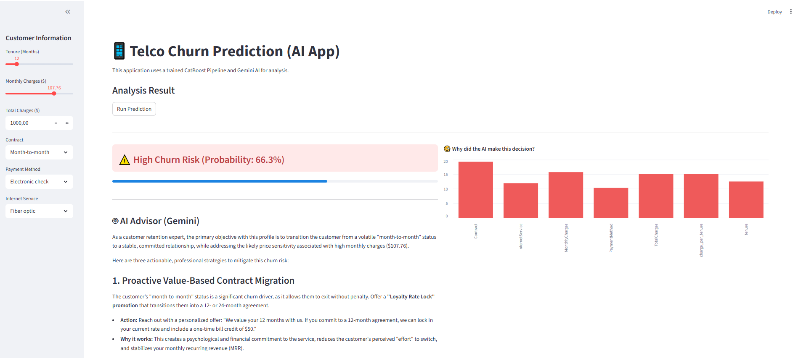
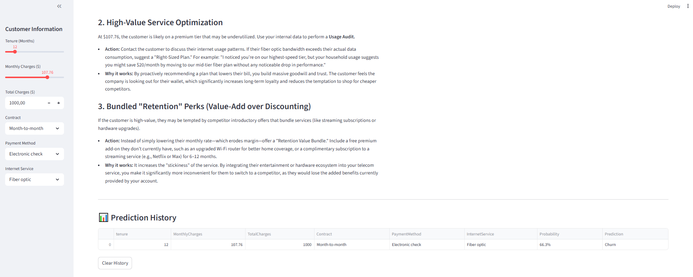

# 📊 Telco Customer Churn Prediction

_An end-to-end Machine Learning project focusing on customer retention, model interpretability, and production-ready deployment._


## 📌 Project Overview

The goal of this project is to predict customer churn for a telecommunications company and identify the key drivers behind customer attrition. Using the **IBM Telco Churn dataset**, I developed a high-performance classification model that provides actionable business insights through model interpretability.

## 🚀 Key Features

- **Native Categorical Support:** Utilized **CatBoost** to handle categorical features efficiently without manual one-hot encoding.
- **Explainable AI (XAI):** Integrated **SHAP** to move beyond "black-box" predictions and visualize feature importance.
- **AI-Driven Strategic Advice:** Integrated **Google Gemini** to generate real-time, actionable retention strategies based on churn risk.
- **High-Performance Backend:** Powered by **FastAPI** for asynchronous, scalable API requests and seamless model serving.
- **Cloud-Native Deployment:** Fully **Dockerized** multi-container setup (Frontend & Backend) for portable and consistent deployment.
- **Robust Pipeline:** Built a scalable workflow from raw data ingestion to model persistence and interactive visualization.

## 🤖 AI-Powered Actionable Strategies

By integrating the Gemini API, the app doesn't just predict risk; it logically explains **why** and suggests mitigation strategies in real-time.

### 📱 Dashboard Overview

The dashboard is designed for clarity, separating the prediction input, statistical results, and AI-driven advice.

<div align="center">
  
  
  <p><i>Left: Customer data input and churn risk prediction. Right: Actionable insights from Gemini AI.</i></p>
</div>
_Main interface showing prediction results and the AI Advisor section._

## 🛠️ Technical Implementation & Challenges

### ⚙️ Technology Integration

- **Backend Orchestration:** Developed a robust **FastAPI** backend to handle asynchronous requests, bridging the data science model and the Generative AI advisor.
- **AI Integration:** Seamlessly integrated **gemini-3.1-flash-lite-preview** via Google AI Studio to provide real-time strategic insights for customer retention.

### 💡 Challenges & Solutions: Handling API Rate Limits

During development, I encountered **HTTP 429 (Resource Exhausted)** errors due to the rate limits of the Gemini API's free tier.

- **The Solution:** Optimized the system by switching to the **gemini-3.1-flash-lite-preview** model and implementing efficient error handling.
- **Result:** This significantly reduced latency and eliminated "quota exceeded" errors, ensuring a stable and professional user experience.

## 📂 Repository Structure

- `app/`:
  - `app.py`: Streamlit frontend for interactive data visualization and user input.
  - `main.py`: FastAPI backend handling model inference and Gemini AI integration.
- `docker/`: Contains the `Dockerfile` for containerizing the application.
- `images/`: High-resolution screenshots of the application dashboard and AI insights.
- `models/`: Serialized trained model (`final_churn_model.joblib`) used for production.
- `notebooks/`: Comprehensive Jupyter Notebook containing EDA, Feature Engineering, and CatBoost model training.
- `docker-compose.yml`: Orchestrates the frontend and backend services for "one-command" deployment.
- `requirements.txt`: Python dependencies for the project.

## 🔍 Model Interpretability (SHAP Analysis)

One of the core strengths of this project is understanding **why** a customer might leave.

### Global Importance

According to the SHAP analysis, the top 3 drivers for churn are:

1. **Contract Type:** Customers on "Month-to-month" plans have a significantly higher risk of churn.
2. **Internet Service:** Fiber optic users show higher attrition rates compared to DSL users.
3. **Tenure & Monthly Charges:** The relationship between loyalty and cost is a critical factor.

## 🛠️ How to Run

1. Clone the repository:
   ```bash
   git clone [https://github.com/MiyukiMol/Telco-Churn-Prediction.git](https://github.com/MiyukiMol/Telco-Churn-Prediction.git)
   ```
